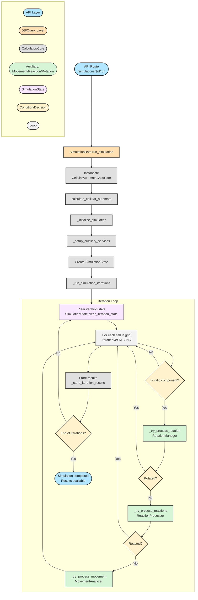

# Cellular Automata Simulation Flowchart

```mermaid
flowchart TB
    %% Entry point
    A([API Route<br>/simulations/$id/run]):::api --> B[SimulationData.run_simulation]:::query
    B --> C[Instantiate<br>CellularAutomataCalculator]:::calc
    C --> D[calculate_cellular_automata]:::calc
    D --> E[_initialize_simulation]:::calc
    E --> F[_setup_auxiliary_services]:::calc
    F --> G[Create SimulationState]:::calc
    G --> H[_run_simulation_iterations]:::calc

    %% Iteration loop
    subgraph Iteration Loop
        direction TB
        I1[Clear iteration state<br>SimulationState.clear_iteration_state]:::state
        I2[For each cell in grid<br>Iterate over NL x NC]:::loop
        I3{Is valid component?}:::cond -->|No| I2
        I3 -->|Yes| I4[_try_process_rotation<br>RotationManager]:::aux
        I4 --> I5{Rotated?}:::cond
        I5 -->|Yes| I2
        I5 -->|No| I6[_try_process_reactions<br>ReactionProcessor]:::aux
        I6 --> I7{Reacted?}:::cond
        I7 -->|Yes| I2
        I7 -->|No| I8[_try_process_movement<br>MovementAnalyzer]:::aux
        I2 --> I10[Store results<br>_store_iteration_results]:::calc
        I10 --> I11{End of iterations?}:::cond
        I11 -->|No| I1
        I11 -->|Yes| J([Simulation completed<br>Results available]):::api
    end

    H --> I1
    I1 --> I2
    I2 --> I3
    I8 --> I2

    %% Visual cues for code structure
    classDef api fill:#b3e6ff,stroke:#333,stroke-width:2px;
    classDef query fill:#ffe0b3,stroke:#333,stroke-width:2px;
    classDef calc fill:#e0e0e0,stroke:#333,stroke-width:2px;
    classDef aux fill:#d6f5d6,stroke:#333,stroke-width:1.5px;
    classDef state fill:#f9e6ff,stroke:#333,stroke-width:1.5px;
    classDef cond fill:#fff2cc,stroke:#333,stroke-width:1.5px;
    classDef loop fill:#f2f2f2,stroke:#333,stroke-width:1.5px;

    %% Legend
    subgraph Legend [ ]
        direction LR
        L1([API Layer]):::api
        L2([DB/Query Layer]):::query
        L3([Calculator/Core]):::calc
        L4([Auxiliary: Movement/Reaction/Rotation]):::aux
        L5([SimulationState]):::state
        L6([Condition/Decision]):::cond
        L7([Loop]):::loop
    end
```
