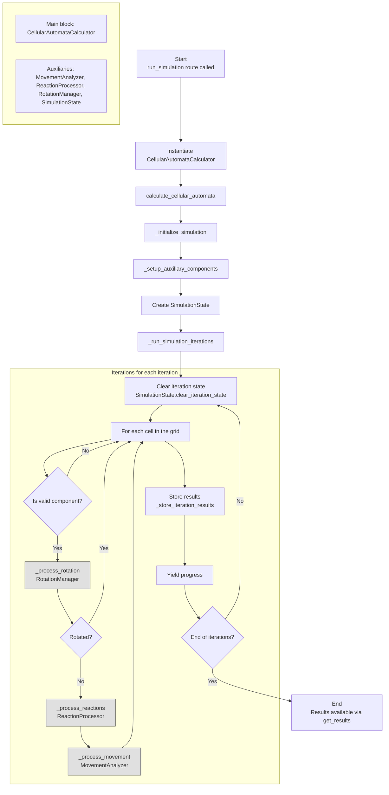

# Cellular Automata Simulation Flowchart

```mermaid
flowchart TD
    A[Start<br>run_simulation route called] --> B[Instantiate CellularAutomataCalculator]
    B --> C[calculate_cellular_automata]
    C --> D[_initialize_simulation]
    D --> E[_setup_auxiliary_components]
    E --> F[Create SimulationState]
    F --> G[_run_simulation_iterations]

    subgraph Iterations for each iteration
        G1[Clear iteration state<br>SimulationState.clear_iteration_state]
        G2[For each cell in the grid]
        G3{Is valid component?}
        G4[_process_rotation<br>RotationManager]
        G5{Rotated?}
        G6[_process_reactions<br>ReactionProcessor]
        G7[_process_movement<br>MovementAnalyzer]
        G8[Store results<br>_store_iteration_results]
        G9{End of iterations?}
        G10[Yield progress]
    end

    G --> G1
    G1 --> G2
    G2 --> G3
    G3 -- No --> G2
    G3 -- Yes --> G4
    G4 --> G5
    G5 -- Yes --> G2
    G5 -- No --> G6
    G6 --> G7
    G7 --> G2
    G2 --> G8
    G8 --> G10
    G10 --> G9
    G9 -- No --> G1
    G9 -- Yes --> H[End<br>Results available via get_results]

    %% Auxiliary classes
    classDef aux fill:#e0e0e0,stroke:#333,stroke-width:1px;
    G4:::aux
    G6:::aux
    G7:::aux

    %% Legend
    subgraph Legend [ ]
        direction LR
        L1[Main block: CellularAutomataCalculator]
        L2[Auxiliaries: MovementAnalyzer, ReactionProcessor, RotationManager, SimulationState]
    end
```
